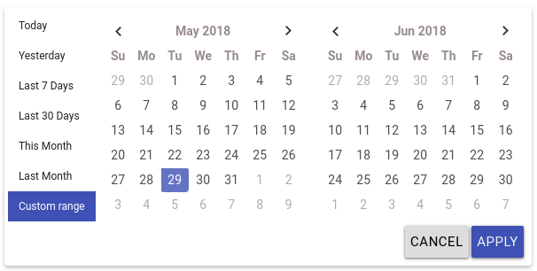

# ngx-daterangepicker-material
> Pure Angular 2+ Date range picker.

[](https://travis-ci.org/fetrarij/ngx-daterangepicker-material)
[](https://badge.fury.io/js/ngx-daterangepicker-material)

 This plugin is compatible with Angular2, Angular4, Angular5 and Angular6. This plugin uses moment.js.

This plugin is a rewrite to angular from [bootstrap daterangepicker](http://www.daterangepicker.com), so it doesn't depends on jquery nor bootstrap.

This plugin have an independant theme which looks more close to material design, so the material design is just a style.




demo:  https://fetrarij.github.io/ngx-daterangepicker-material/

## Installation

 Install the plugin from npm:
 
 `npm install ngx-daterangepicker-material --save` .

 import **NgxDaterangepickerMd** in your module:

````typescript
...
import { FormsModule } from '@angular/forms';
import { NgxDaterangepickerMd } from 'ngx-daterangepicker-material';
import { App } from './app';

@NgModule({
    imports:      [... , FormsModule, NgxDaterangepickerMd],
    declarations: [App],
    bootstrap:    [App]
})
export class AppModule {}
````

## Usage example

Html:

```html
<input type="text" ngxDaterangepickerMd [(ngModel)]="selected" class="form-control"/>
```
Typescript: 

````typescript
selected: {startdDate: Moment, endDate: Moment};
````
### with some options: 
Html:

```html
<input type="text" matInput
    ngxDaterangepickerMd
    [locale]="{applyLabel: 'ok', format: 'DD-MM-YYYY'}"
    startKey="start"
    endKey="end"
    [(ngModel)]="selected"
    name="daterange"/>
```
Typescript: 

````typescript
selected: {start: Moment, end: Moment};
````
You can [play with our online demo here](https://fetrarij.github.io/ngx-daterangepicker-material/)
and [browse our demo code here](./demo/src/app).


## Available options

### autoApply, showDropdowns, singleDatePicker, showWeekNumbers, showISOWeekNumbers, alwaysShowCalendars, showClearButton

>These options are booleans

### isCustomDate

>(function) A function that is passed each date in the calendars before they are displayed, and may return a string or array of CSS class names to apply to that date's calendar cell

### isInvalidDate
>(function) A function that is passed each date in the two calendars before they are displayed, and may return true or false to indicate whether that date should be available for selection or not.

### minDate, maxDate

 >To set the minimal and maximal date, these options are a moment date

### locale

>the locale options is an object with: 
```javascript
{
    format: 'MM/DD/YYYY',
    separator: ' To ', // default is ' - '
    cancelLabel: 'Cancel', // detault is 'Cancel'
    applyLabel: 'Okay' // detault is 'Apply'
    firstDay: 1 // first day is monday
}
```
### startKey and endKey

Theses 2 options are for the key you want for the value, default are `startDate` and `endDate`, it means the value we have from ngModel are: `{startDate: Date, endDate: Date}` by default;

Specifiyng `startKey` and `endKey` would have different model:

example: 
```html
<input type="text" ngxDaterangepickerMd startKey="start" endKey="end" [(ngModel)]="model">
```

the model we got would be:  `{start: Date, end: Date}`

### ranges

(object) Set predefined date ranges the user can select from. Each key is the label for the range, and its value an array with two dates representing the bounds of the range. As an example:
```html
<input type="text" ngxDaterangepickerMd startKey="start" endKey="end" [ranges]="ranges" [(ngModel)]="model">
```
```javascript
ranges: any = {
    'Today': [moment(), moment()],
    'Yesterday': [moment().subtract(1, 'days'), moment().subtract(1, 'days')],
    'Last 7 Days': [moment().subtract(6, 'days'), moment()],
    'Last 30 Days': [moment().subtract(29, 'days'), moment()],
    'This Month': [moment().startOf('month'), moment().endOf('month')],
    'Last Month': [moment().subtract(1, 'month').startOf('month'), moment().subtract(1, 'month').endOf('month')]
  }
```

## [License](https://github.com/fetrarij/ngx-daterangepicker-material/blob/master/LICENSE)